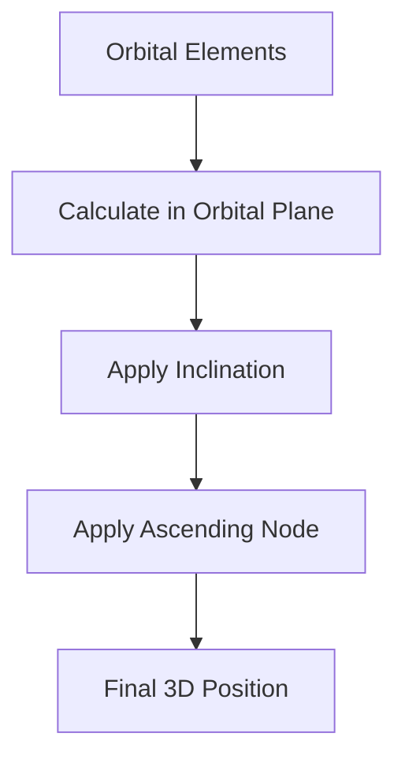
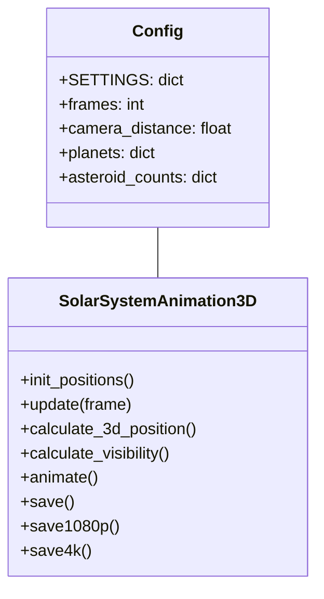

# Solar System 3D Animation

A comprehensive 3D visualization of our solar system including planets, moons, asteroid belts, and the Oort cloud implemented in Python using Matplotlib.


## Features

- Full 3D representation of the solar system
- Accurate orbital mechanics based on Kepler's laws
- Includes all planets and major moons
- Visualization of:
  - Asteroid Belt
  - Hildas Group
  - Jupiter Trojans
  - Kuiper Belt
  - Inner Oort Cloud (Hills Cloud)
  - Outer Oort Cloud
- Dynamic camera with smooth zoom
- Multiple output formats (GIF, 1080p MP4, 4K MOV)
- Light and dark theme options

## Mathematical Physics

### Orbital Mechanics

The simulation uses Kepler's laws of planetary motion to calculate orbital positions:

1. **Kepler's First Law**: Orbits are elliptical with the Sun at one focus
   }{1+e\cos\theta})
   where:
   - r = distance from the sun
   - a = semi-major axis
   - e = eccentricity
   - θ = true anomaly

2. **Kepler's Second Law**: Equal areas are swept in equal times
   

3. **Kepler's Third Law**: The square of the orbital period is proportional to the cube of the semi-major axis
   

### 3D Position Calculation

The position of celestial bodies is calculated using:



Position calculation formula:


Where:
- Ω = ascending node
- i = inclination
- r = orbital radius
- θ = orbital angle

## System Architecture



## Requirements

- Python 3.7+
- NumPy
- Matplotlib
- FFmpeg (for video output)

## Installation

```bash
pip install numpy matplotlib
# For video output
apt-get install ffmpeg  # Linux
brew install ffmpeg    # macOS
```

## Usage

Basic usage:

```python
from complete_solar_system_3d import SolarSystemAnimation3D

# Create animation
solar_system = SolarSystemAnimation3D(style='default')

# Display animation
solar_system.animate()

# Save as GIF
solar_system.save("solar_system.gif")

# Save as 1080p video
solar_system.save1080p("solar_system_1080p.mp4")

# Save as 4K video
solar_system.save4k("solar_system_4k.mov")
```

## Customization

You can modify the Config.SETTINGS dictionary to:
- Adjust animation frames
- Change camera behavior
- Modify planet/moon properties
- Adjust asteroid population sizes

## Performance Notes

- The animation is computationally intensive, especially with large asteroid populations
- 4K rendering requires significant memory and processing power
- Consider reducing asteroid counts for smoother performance

## License

MIT License - feel free to use and modify for your own projects!
